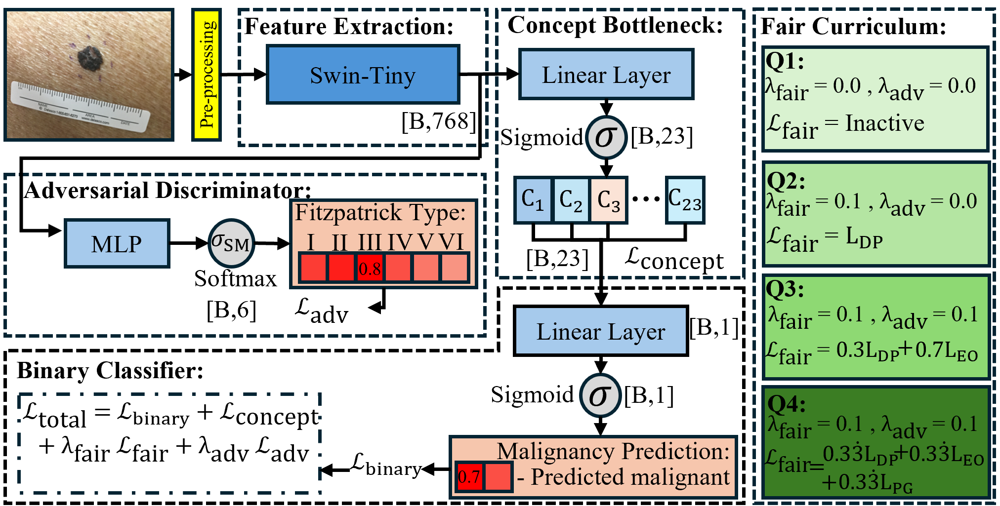
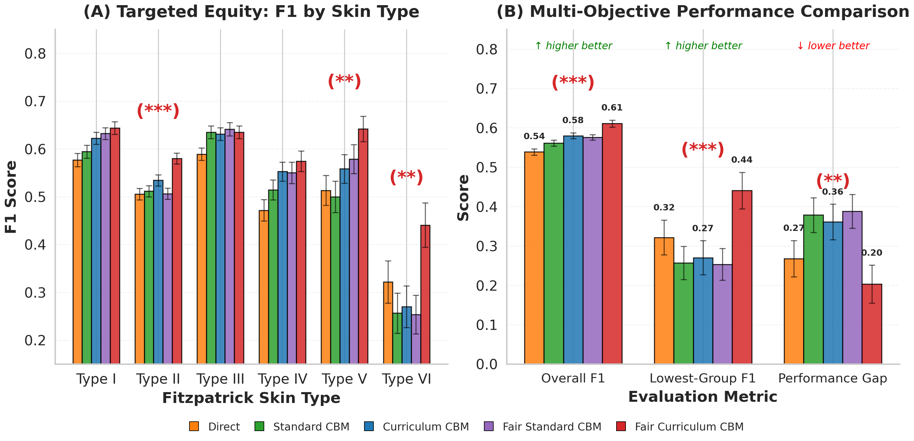

# FairCBM: Fairness-First Curriculum Learning for Concept Bottleneck Models

**Matthew J. Cockayne, Marco Ortolani, Baidaa Al-Bander** — MICCAI 2026

School of Computer Science and Mathematics, Keele University

---

## Overview

Deep learning models for dermatology exhibit systematic performance disparities across skin types, with darker-skinned patients experiencing significantly lower diagnostic accuracy. These disparities arise from dataset imbalance (medical imaging datasets over-represent Fitzpatrick types I--III), biased feature extraction, and evaluation practices that report aggregate rather than per-group performance. Concept Bottleneck Models (CBMs) [Koh et al., 2020] address interpretability by routing predictions through an intermediate layer of human-interpretable concepts, but lack explicit fairness mechanisms.

FairCBM introduces a four-phase fairness-first curriculum for CBMs that reframes curriculum learning from task-difficulty ordering to fairness-objective ordering. Rather than progressing from easy to hard concepts, training is structured across four successive phases: balanced foundation, demographic parity, equalized odds, and performance parity. All 23 morphological concepts are trained jointly throughout. The fairness loss composition, sampling strategy, and adversarial debiasing weight change between phases. This progressive structure stabilises adversarial debiasing by introducing fairness constraints incrementally rather than simultaneously.

On SkinCon (3,230 dermatological images, six Fitzpatrick types), Fair Curriculum CBM achieves a 44% reduction in performance gap between skin types (0.361 to 0.203, p=0.003), a 63% improvement in lowest-group F1 (0.270 to 0.441, p<0.001), and a simultaneous 5.3% gain in overall F1 (0.580 to 0.611, p<0.001). Per-type analysis confirms targeted improvements on types II, V, and VI (p<0.005) with no statistically significant degradation on lighter skin types (p>0.13). Results are validated across 100 independent runs per model.

**Figure 1: Model architecture and four-phase curriculum.**



**Figure 2: Main results — per-skin-type F1 and multi-objective comparison.**



---

## Repository Structure

```
FairCBM/
├── src/                        # Core library
│   ├── models/
│   │   ├── fair_curriculum_cbm.py      # Main model (four-phase curriculum)
│   │   ├── fairness_aware_cbm.py       # Fair Standard CBM baseline
│   │   ├── minimal_curriculum_cbm.py   # Concept-difficulty curriculum baseline
│   │   ├── standard_cbm.py             # Standard CBM baseline
│   │   ├── direct_classifier.py        # Direct (non-interpretable) baseline
│   │   └── adversarial_discriminator.py
│   ├── utils/
│   │   ├── fairness_metrics.py         # Fairness metric computation
│   │   └── adversarial_debiasing.py    # Fairness loss functions
│   └── data/
│       └── dataloader.py               # SkinCap dataset with Fitzpatrick labels
├── scripts/                    # Training and evaluation scripts
│   ├── train_all_models.py             # Train any of the five model types
│   ├── train_ablation.py               # Ablation study training
│   ├── analyze_multi_run_results.py    # Aggregate multi-run statistics → results/analysis
│   ├── evaluate_fairness_comparison.py # Cross-model fairness comparison
│   ├── generate_fairness_statistics_tables.py
│   └── download_weights.py             # Download pretrained backbone weights
├── slurm/                      # SLURM batch scripts
│   ├── run_multi_experiments.slurm     # 100-run array job (main experiments)
│   ├── run_single_experiment.slurm     # Single test run
│   └── run_ablation_study.slurm
├── figures/                    # Paper figures (tracked by git)
├── data/                       # Concept and class label lists
├── docs/                       # Documentation and paper source
└── results/                    # Experiment outputs (not tracked)
```

---

## Environment Setup

### 1. Create and activate the conda environment

```bash
conda create -n CBM-env python=3.10 -y
conda activate CBM-env
```

### 2. Install dependencies

```bash
pip install -r requirements.txt
```

Core requirements: PyTorch ≥ 2.0, torchvision, numpy, pandas, scipy, scikit-learn, matplotlib, seaborn, tqdm.

### 3. Download pretrained backbone weights

This must be done on the **head node** before submitting SLURM jobs, as compute nodes may not have internet access:

```bash
conda activate CBM-env
python scripts/download_weights.py
```

---

## Data Preparation

### Dataset availability

The dataset is available at [https://huggingface.co/datasets/joshuachou/SkinCAP](https://huggingface.co/datasets/joshuachou/SkinCAP). SkinCAP extends the SkinCON benchmark [Daneshjou et al., 2022] with free-text natural language captions per image; SkinCON itself provides the 3,230 dermatological images, six Fitzpatrick skin type labels, binary malignancy labels, and 23 binary morphological concept annotations. The experiments in this work use only the SkinCON-derived structured annotations (images, Fitzpatrick labels, concept labels, and malignancy labels); the free-text captions are not used.

### Directory structure

The SkinCAP dataset should be organised as follows:

```
/path/to/SkinCAP/
├── skincap/             # Image directory
│   ├── <image_id>.png
│   └── ...
└── skincap_v240623.csv  # Metadata with Fitzpatrick labels and concept annotations
```

The CSV must contain columns: `skincap_file_path`, `malignant` (0/1), `fitzpatrick_scale` (1–6), and the 23 concept columns (Papule, Plaque, Nodule, etc.). The dataloader splits are constructed programmatically; no separate split files are required.

---

## Running Experiments

### Single test run (interactive or single SLURM job)

```bash
python scripts/train_all_models.py \
    --model_type fair_curriculum_cbm \
    --backbone swin \
    --exp_name test_run \
    --epochs 100 \
    --batch_size 32 \
    --fairness_lambda 0.1 \
    --adversarial_lambda 0.01 \
    --data_root /path/to/SkinCAP \
    --raw_csv /path/to/SkinCAP/skincap_v240623.csv \
    --save_dir results \
    --eval_every 5 \
    --seed 42
```

Model type options: `direct`, `standard_cbm`, `fair_standard_cbm`, `curriculum_cbm`, `fair_curriculum_cbm`.  
Backbone options: `swin`, `convnext`, `vit`, `efficientnet`, `mobilenet`.

To submit a single run via SLURM:

```bash
sbatch slurm/run_single_experiment.slurm fair_curriculum_cbm swin 42
```

### Multi-run experiments (100 seeds, all five models)

The main experiment trains all five models across 100 independent seeds as a SLURM array job. Before submitting, ensure the conda environment is set up and backbone weights have been downloaded (see above).

**Default: 100 runs, 10 concurrent**

```bash
sbatch slurm/run_multi_experiments.slurm
```

**Custom number of runs (e.g., 20 for rapid validation)**

```bash
sbatch --array=1-20 slurm/run_multi_experiments.slurm
```

The script trains all five models per array task, then on completion of the final task automatically calls `scripts/analyze_multi_run_results.py` to aggregate results into `results/analysis/`. Key configuration variables at the top of the script:

| Variable | Default | Description |
|---|---|---|
| `BACKBONE` | `swin` | Pretrained encoder |
| `DATA_ROOT` | `/home/csc29/projects/SkinCAP` | Dataset root |
| `EPOCHS` | `100` | Epochs per model |
| `BATCH_SIZE` | `32` | Batch size |
| `FAIRNESS_LAMBDA` | `0.1` | Fairness loss weight |
| `ADVERSARIAL_LAMBDA` | `0.01` | Adversarial discriminator weight |

Edit these variables in `slurm/run_multi_experiments.slurm` before submission to match your cluster paths and resource requirements.

### Analyse aggregated results

After all array tasks complete, results can be re-analysed or regenerated:

```bash
python scripts/analyze_multi_run_results.py \
    --exp_name multi_run_<JOB_ID> \
    --backbone swin \
    --n_runs 100
```

Outputs written to `results/analysis/`:
- `all_results.csv` — per-run metrics for all models
- `summary_table.csv` / `summary_table.tex` — mean ± std
- `statistical_tests.csv` — pairwise paired t-tests
- `metric_distributions.png`, `main_results_figure.png` — figures

---

## Method Summary

### Four-Phase Fairness-First Curriculum

FairCBM partitions training into four phases by epoch fraction. All 23 morphological concepts are trained jointly throughout; only the fairness loss composition and sampling strategy change between phases.

| Phase | Epoch fraction | Fairness loss | Sampling | Adversarial λ |
|---|---|---|---|---|
| 1 — Balanced foundation | 0–25% | None | Equal per Fitzpatrick type | 0 |
| 2 — Demographic parity | 25–50% | $L_\text{DP}$ | Equal per Fitzpatrick type | 0 |
| 3 — Equalized odds | 50–75% | $0.3 L_\text{DP} + 0.7 L_\text{EO}$ | Stratified by (group × label) | 0 → 0.01 (warmup) |
| 4 — Performance parity | 75–100% | $\frac{1}{3}(L_\text{DP} + L_\text{EO} + L_\text{PG})$ | Error-driven (oversample low-F1 groups) | 0.01 |

**Total loss:**

$$\mathcal{L} = \mathcal{L}_\text{concept} + \mathcal{L}_\text{binary} + \lambda_\text{fair}(t)\,\mathcal{L}_\text{fairness}(t) + \lambda_\text{adv}(t)\,\mathcal{L}_\text{adversarial}$$

Phase transitions are computed automatically from `epoch / total_epochs`; no manual configuration is required.

---

## Baseline Models

| Model | Interpretable | Curriculum | Fairness constraints |
|---|---|---|---|
| Direct | No | — | None |
| Standard CBM | Yes | None | None |
| Curriculum CBM | Yes | Concept difficulty (easy→hard) | None |
| Fair Standard CBM | Yes | None | Static ($L_\text{DP} + L_\text{EO}$) |
| **Fair Curriculum CBM** | **Yes** | **Fairness-first (four phases)** | **Dynamic, phased** |

---

## Results

Reported values are means ± standard deviation over 100 independent runs.

| Model | F1 | Recall | Lowest-group F1 | Performance gap | DP disparity |
|---|---|---|---|---|---|
| Direct | 0.539 ± 0.081 | 0.495 ± 0.103 | 0.322 ± 0.044 | 0.267 ± 0.046 | 0.138 ± 0.042 |
| Standard CBM | 0.561 ± 0.076 | 0.504 ± 0.103 | 0.257 ± 0.042 | 0.379 ± 0.044 | 0.136 ± 0.036 |
| Curriculum CBM | 0.580 ± 0.074 | 0.538 ± 0.100 | 0.270 ± 0.043 | 0.361 ± 0.045 | 0.143 ± 0.039 |
| Fair Standard CBM | 0.576 ± 0.071 | 0.534 ± 0.109 | 0.253 ± 0.040 | 0.388 ± 0.043 | 0.140 ± 0.046 |
| **Fair Curriculum CBM** | **0.611 ± 0.088** | **0.625 ± 0.123** | **0.441 ± 0.046** | **0.203 ± 0.048** | 0.142 ± 0.050 |

All improvements of Fair Curriculum CBM over Curriculum CBM on F1, recall, lowest-group F1, and performance gap are statistically significant (paired t-test, $p \leq 0.003$). DP disparity is unchanged ($p = 0.86$).

---

## Fairness Metrics

### Evaluation metrics

| Metric | Definition |
|---|---|
| Lowest-group F1 (LG-F1) | $\min_g F1_g$ across Fitzpatrick types I--VI |
| Performance Gap | $\max_g F1_g - \min_g F1_g$ |
| DP Disparity | $\max_a P(\hat{Y}=1 \mid A=a) - \min_a P(\hat{Y}=1 \mid A=a)$ |

### Training fairness losses

| Loss | Definition | Active phases |
|---|---|---|
| $\mathcal{L}_\text{DP}$ | $\sum_{a,a'} \lvert \mathbb{E}_{x \sim a}[\sigma(f(x))] - \mathbb{E}_{x \sim a'}[\sigma(f(x))] \rvert$ | 2, 3, 4 |
| $\mathcal{L}_\text{EO}$ | $\sum_{y,a,a'} \lvert \mathbb{E}[\sigma(f(x)) \mid y,a] - \mathbb{E}[\sigma(f(x)) \mid y,a'] \rvert$ | 3, 4 |
| $\mathcal{L}_\text{PG}$ | $\max_a \widetilde{F1}_a - \min_a \widetilde{F1}_a$ (soft-F1) | 4 |

---

## Citation

```bibtex
@inproceedings{cockayne2026faircbm,
  title     = {Fair Curriculum Learning for Concept Bottleneck Models in Dermatology},
  author    = {Matthew J. Cockayne, Marco Ortolani, Baidaa Al-Bander},
  year      = {2026}
}
```
